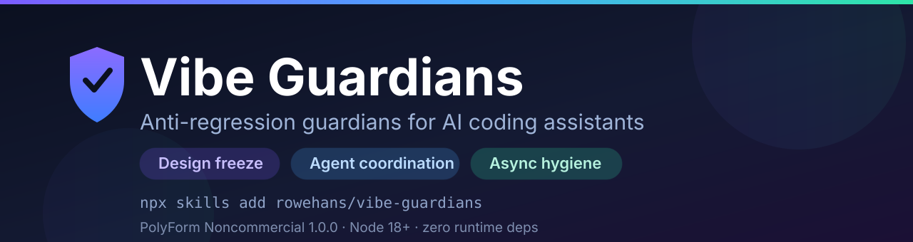

<p align="center">
  
</p>

# 🛡️ Vibe Guardians

> **Anti-regression guardians for AI coding assistants.** Design freeze, multi-agent file locking, and async hygiene as test suites your AI actually has to pass — for Cursor, Claude Code, Codex, GitHub Copilot, Windsurf, Antigravity, Jules, Amp and Aider.

[](https://github.com/rowehans/vibe-guardians/actions/workflows/ci.yml)
[](LICENSE)
[](https://nodejs.org/)
[](#faq)
[](https://skills.sh)
[](AGENTS.md)
[](llms.txt)
[](CONTRIBUTING.md)

**Ask a model to fix a backend endpoint. Watch it restyle your buttons, delete a paragraph of marketing copy, and forget an `await` in front of a database write.** Prompting is not enforcement. Vibe Guardians turns the invariants you care about into failing tests, so the assistant either satisfies them or cannot claim the task is done.

---

## The three failure modes

| What goes wrong | Who breaks it | What stops it |
|---|---|---|
| 🎨 **Silent redesign** — brand colors shift, spacing drifts, headline copy gets "improved" during an unrelated refactor | Every assistant, every refactor | [`design-freeze-guardian`](skills/design-freeze-guardian/) hashes your tokens, palettes and critical copy; an unauthorized change fails the suite |
| 💥 **Agent collisions** — two agents (or two subagents) edit the same file, last write silently wins | Multi-agent setups, parallel worktrees, subagent fan-out | [`agent-coordinator`](skills/agent-coordinator/) locks file scopes behind atomic leases and refuses to close a task without evidence |
| 🕳️ **Silent async defects** — `await` omitted before a mutation, exception swallowed by an empty `catch` | Autocomplete-style code generation | [`ast-async-hygiene`](skills/ast-async-hygiene/) parses the AST and rejects floating promises and empty catches |

---

## Quickstart

### Install as agent skills

```bash
# all three guardians
npx skills add rowehans/vibe-guardians

# or one at a time, straight into your global agent config
npx skills add rowehans/vibe-guardians -s design-freeze-guardian -g -y
npx skills add rowehans/vibe-guardians -s agent-coordinator      -g -y
npx skills add rowehans/vibe-guardians -s ast-async-hygiene      -g -y
```

### Or drive the coordinator CLI directly

```bash
# who holds what, right now
node skills/agent-coordinator/scripts/agent-coord.mjs status

# refuse to edit outside my declared scope
node skills/agent-coordinator/scripts/agent-coord.mjs guard --agent Cursor --scope src/app.js

# take an atomic lease on a task
node skills/agent-coordinator/scripts/agent-coord.mjs claim --create --id TASK-01 --agent Cursor --scope src/app.js --minutes 60

# close it — and attach the evidence that proves it was done
node skills/agent-coordinator/scripts/agent-coord.mjs finish --id TASK-01 --agent Cursor --result "Feature complete"
```

### Or copy a template into your own suite

Each skill ships the executable test it describes, under `skills/*/template/`. Drop it into your test directory, point it at your config, and run it with `node --test`.

---

## What you get

```
skills/
  agent-coordinator/        file-lock CLI + coordination board  (zero dependencies)
  design-freeze-guardian/   token/palette/copy freeze suite     (zero dependencies)
  ast-async-hygiene/        floating-promise + empty-catch lint (uses acorn)
rules/
  fail-closed-builds.md     why an unverifiable check must fail the build
  anti-overfitting.md       how to keep a test meaningful instead of tuned
```

**Fail-closed by default.** A guardian that cannot verify its subject fails instead of skipping, and its message names the file, the line, the cause and the remedy — never just `expected true, got false`.

---

## Works with

Vibe Guardians is agent-agnostic. The protocols are plain Markdown and the checks are plain Node, so nothing here depends on a specific vendor:

**Codex** · **Cursor** · **GitHub Copilot** · **Claude Code** · **Windsurf** · **Antigravity** · **Gemini CLI** · **Jules** · **Amp** · **Aider** · **goose** · **opencode** · **Zed** · **Warp** · **Devin** · **Junie** · **RooCode** · **Kilo Code**

Agents that read [`AGENTS.md`](AGENTS.md) get this repo's conventions automatically; tools that read [`llms.txt`](llms.txt) get a machine-readable map of every skill and rule.

---

## Using it with your own agent

1. **Install the skill** you want (above) — it lands in your agent's skills directory.
2. **Encode the invariant.** For design freeze, run the suite once on the approved build to capture the baseline; for hygiene, point the linter at the files your agent touches.
3. **Wire it into your gate.** Run the suite in `npm test` or CI. The assistant now has to satisfy it, not just be asked to.
4. **Keep it honest.** Baselines only change through an explicit, recorded authorization — never because a test was inconvenient.

---

## Development

```bash
npm install
npm test        # native node:test runner — every suite in test/
```

Requirements: **Node 18+**. ESM only. No build step, no bundler, no test framework. See [`AGENTS.md`](AGENTS.md) for conventions and [`CONTRIBUTING.md`](CONTRIBUTING.md) before opening a PR.

## FAQ

**Does this add runtime dependencies to my project?** No. The coordinator CLI and both test templates use Node builtins only; only the AST analyzer pulls in `acorn` and `acorn-walk`, and only when you run it.

**Is it a prompt, or is it enforcement?** Enforcement. Prompts are advisory and get diluted by context; a suite that fails is not. That is the entire design premise.

**Can I use it commercially?** Not without a license — see below.

**What if a guard cannot check itself?** It fails. That is the point of [fail-closed builds](rules/fail-closed-builds.md).

## Security

Do not paste proprietary code, credentials or customer data into a repository that uses these templates; report vulnerabilities as described in [`SECURITY.md`](SECURITY.md).

---

## 📜 License & Terms of Use (Términos de Uso)

This project is licensed under the **PolyForm Noncommercial License 1.0.0** — the canonical text is in [`LICENSE`](LICENSE), with commercial rights reserved by the author.

| Permitted / Permitido ✅ | Prohibited / Prohibido ❌ |
|---|---|
| **Personal Use:** Free for individual developers and hobby projects. | **Commercial Resale:** Selling, charging for, or reselling this tool. |
| **Education & Learning:** Free for students, researchers, and schools. | **Paid Bundling:** Packaging inside paid extensions, SaaS, or commercial software. |
| **Forking & Modifying:** Adapting the code for personal non-profit needs. | **Enterprise Profit:** Commercial entities using it for business advantage without a commercial license. |

### 💼 Commercial Licensing (Licenciamiento Comercial)

Are you a company, startup, or enterprise wanting to integrate Vibe Guardians into your commercial products, IDE extensions, or internal corporate workflows?

**Commercial licenses are available.** Open an inquiry on [GitHub Issues](https://github.com/rowehans/vibe-guardians/issues) or contact the project maintainers.

---

<p align="center">
  <b>If this saved you from one silent regression, star the repo ⭐ — it helps other builders find it.</b><br>
  <em>Crafted by the Vibe Guardians Open Community.</em>
</p>
